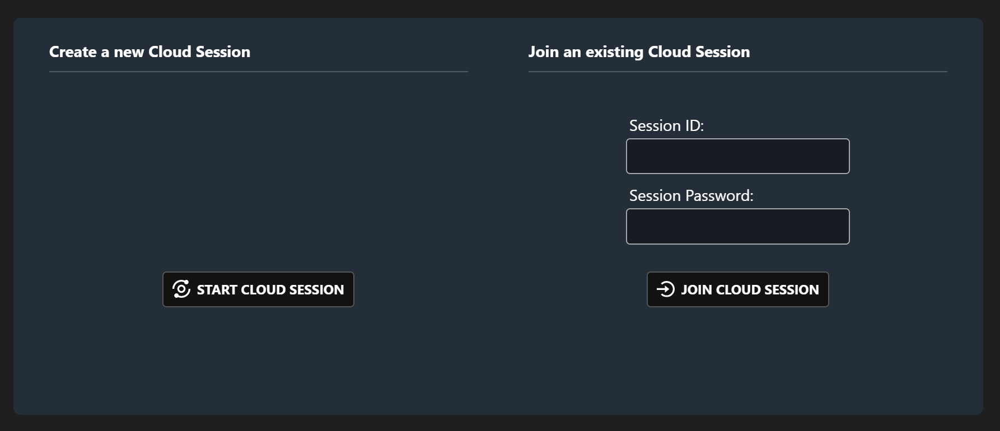
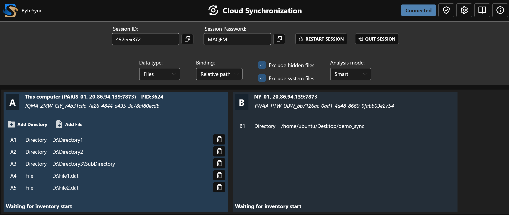

  

<h3>Sync, Backup & Deduplication — Cross-platform, LAN & WAN</h3>

  

    <!-- License -->
    
    <!-- Last commit -->
    
    <!-- GitHub stars -->
    
    <!-- Platform -->
    
    <!-- Language -->
    
  

  

    <a href="https://www.bytesyncapp.com/">Website</a> •
    <a href="https://www.bytesyncapp.com/documentation">Documentation</a> •
    <a href="https://www.bytesyncapp.com/blog">Blog</a> •
    <a href="https://github.com/POW-Software/ByteSync/discussions">Community</a>
  

# 🌀 ByteSync

**Free, open-source software for file synchronization, backup & deduplication — local or remote, secure, and cross-platform.**  
No VPN. No setup. Full control.

---

## 🔍 Overview

**ByteSync** is an **on-demand file synchronization, backup and deduplication tool** designed for professionals, teams, and individuals.  
It works **locally or across remote sites** with **no VPN, firewall, or manual configuration** required.

ByteSync compares files using a **block-level delta engine** and transfers only modified parts, saving time and bandwidth.  
All data is protected with **end-to-end encryption (E2EE)**, ensuring privacy even when synchronization passes through remote connections.

---

## 🧠 Key Features

- ⚡ **Hybrid synchronization** — works across LAN and remote endpoints automatically.
- 🔒 **End-to-end encryption** — no data ever leaves your devices unencrypted.
- 📦 **Delta-based transfers** — only modified data blocks are exchanged.
- 🧩 **Backup & deduplication** — compare, clean, and consolidate datasets easily.
- 💻 **Cross-platform** — runs on **Windows, Linux, and macOS**.
- 🚫 **Zero network configuration** — no VPN, no port forwarding, no hassle.
- ⚙️ **Rule-based control** — define granular synchronization conditions and actions.
- 🧾 **Transparent results** — full comparison and report before applying changes.

---

## 🌍 How It Works

ByteSync automatically detects the best route between endpoints:

- **Local peers** communicate directly through LAN for maximum speed.
- **Remote peers** connect securely through encrypted relay channels.
- You can mix **local and remote endpoints** in the same session effortlessly.

This hybrid model makes ByteSync ideal for distributed setups, multi-site businesses, or personal backups.

    

---

## 🧰 Use Cases

- 🏢 **Small Business:** synchronize local servers and remote backup sites.
- 💾 **IT Teams:** keep distributed datasets consistent across multiple environments.
- 🏠 **Home Users:** sync between PC, NAS, and cloud backup targets.
- 🧹 **Deduplication:** identify and remove duplicate files using filtering and rule-based actions.
- 🎬 **Creative Studios:** collaborate efficiently on large media files with delta-based transfers.

---

## 📷 Gallery

  

     
    Create or Join a Synchronization Session
      
  

  

     
    Settings & Data Sources
      
  

  

     
    Inventory Status & Comparison Results
      
  

  

     
    Synchronization
      
  

---

## 🧩 Installation

### Download the Precompiled Client 
1. Visit our [official website](https://www.bytesyncapp.com#download).
2. Download the right version for your operating system.

### Building from Source
If you prefer to build ByteSync from source or want to deploy specific components:

- For **client-side deployment** steps, refer to [docs/client-deployment.md](docs/client-deployment.md).
- For **server-side deployment** steps, refer to [docs/server-deployment.md](docs/server-deployment.md).

---

## 🧑‍💻 Support
If you encounter any issues or if you have feature requests, please open an [issue](https://github.com/POW-Software/ByteSync/issues) on GitHub.

---

## 🛡️ License
This project is licensed under the [MIT License](https://github.com/POW-Software/ByteSync/blob/master/LICENSE).