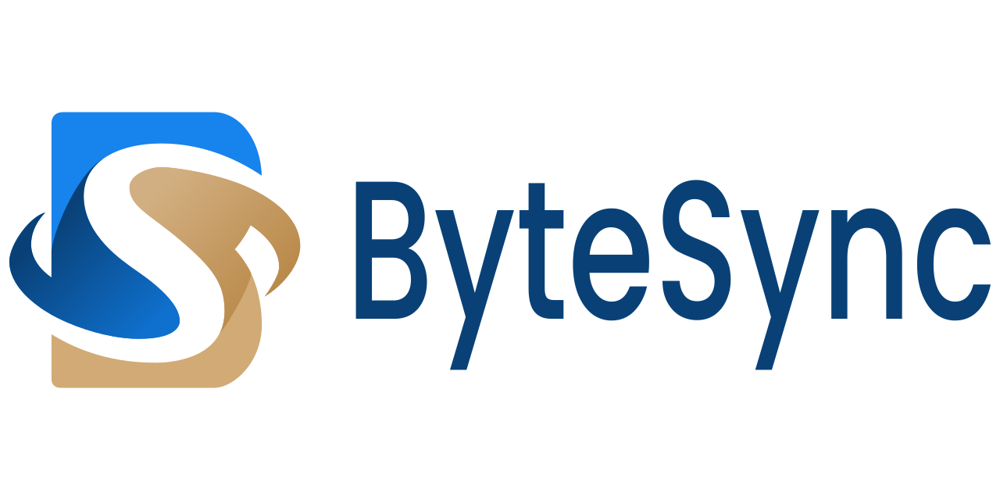

  
  

    
  

# ByteSync

**ByteSync** is an open-source on-demand file synchronization software designed to efficiently and securely synchronize files across systems. With end-to-end encryption, ByteSync ensures your data remains private and protected during transfers. By transferring only the differences between files, it optimizes speed and resource usage. Its advanced features make it a modern, self-orchestrated alternative to traditional FTP solutions.

---

## Table of Contents
- [Features](#features)
- [Gallery](#gallery)
- [Installation](#installation)
- [Usage](#usage)
- [Contributing](#contributing)
- [Support](#support)
- [License](#license)

---

## Features

- **End-to-end encryption**: Ensures your data is secure and private.
- **Smart synchronization**: Transfers only the differences between files to reduce transfer times and resource usage.
- **Multi-device support**: Synchronize data across up to 5 remote machines.
- **Fine-grained sync rules**: Customize synchronization rules to meet your specific needs.
- **Self-orchestrated system**: No need for a centralized FTP server.
- **Cross-platform**: Compatible with Windows, MacOS, and Linux.
- **Open-source**: Flexible and customizable for your needs.

---

## Gallery

  

     
    Create or Join a Cloud Session
      
  

  

     
    Settings & Data Sources
      
  

  

     
    Inventory Status & Comparison Results
      
  

  

     
    Synchronization
      
  

---

## Installation

### Download the Precompiled Client 
1. Visit our [official website](https://www.bytesyncapp.com#download).
2. Download the right version for your operating system.

### Building from Source
If you prefer to build ByteSync from source or want to deploy specific components:

- For **client-side deployment** steps, refer to [docs/client-deployment.md](docs/client-deployment.md).
- For **server-side deployment** steps, refer to [docs/server-deployment.md](docs/server-deployment.md).

---

## Support
If you encounter any issues or if you have feature requests, please open an [issue](https://github.com/POW-Software/ByteSync/issues) on GitHub.

---

## License
This project is licensed under the [MIT License](https://github.com/POW-Software/ByteSync/blob/master/LICENSE).